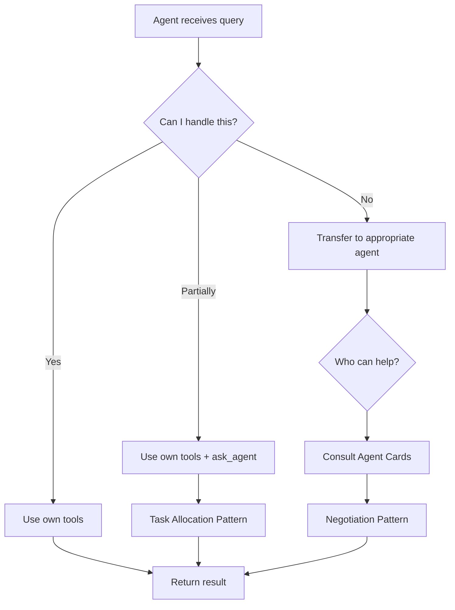

# 🤝 Agent-to-Agent Coordination Documentation

## Overview

This document explains how agents coordinate and transfer control in the TRUE A2A-MCP system.

---

## 🎯 Three Core Coordination Patterns

### 1. **Task Allocation** 📋

**Definition:** An agent receives a complex task and delegates subtasks to appropriate agents.

**How It Works:**
```
Primary Agent receives complex query
    ↓
Analyzes query and identifies subtasks
    ↓
Consults agent cards to find capable agents
    ↓
Delegates each subtask via ask_agent tool
    ↓
Collects results and synthesizes response
```

**Example:**
```
Query: "Get complete profile for customer 5"

support_agent (primary):
  1. Identifies need for customer info + ticket history
  2. Delegates to customer_data_agent: "Get customer 5"
  3. Delegates to self: "Get tickets for customer 5"
  4. Combines results into complete profile
```

**Code Flow:**
```python
# Support agent receives query
query = "Get customer 5 with all tickets"

# Agent's LLM reasons about subtasks
# → Decides to call customer_data agent

# Uses ask_agent tool
result = ask_agent(
    agent_name="customer_data",
    query="Get full details for customer 5"
)

# Continues with own task (get tickets)
tickets = get_customer_history(customer_id=5)

# Synthesizes final response
return combine(customer_info, tickets)
```

**Logging:**
```python
from a2a.a2a_logger import log_task_allocation

log_task_allocation(
    "support_agent",
    ["customer_data", "support"],
    {
        "customer_data": "Get customer info",
        "support": "Get ticket history"
    }
)
```

**Visual Log:**
```
📋 [support_agent]: Allocating tasks to 2 agents
    • agents: ['customer_data', 'support']
    • tasks: {'customer_data': 'Get customer info', 'support': 'Get tickets'}
📤 [support_agent] → [customer_data]: Get details for customer 5
📥 [customer_data] → [support_agent]: Completed request
```

---

### 2. **Negotiation** 🤝

**Definition:** Agents negotiate when capabilities don't match, transferring tasks to better-suited agents.

**How It Works:**
```
Agent A receives query
    ↓
Analyzes if it can handle the query
    ↓
If NO: Consults agent cards
    ↓
Identifies Agent B with better capability
    ↓
Negotiates/transfers task to Agent B
    ↓
Returns Agent B's result to user
```

**Example:**
```
Query: "Find customers whose name starts with 'A' created last week"

customer_data_agent (primary):
  1. Recognizes complex filter (pattern + date)
  2. Checks own tools: list_customers only supports status filter
  3. Consults agent cards: sql agent handles complex filters
  4. Negotiates: "This needs SQL, transferring to sql agent"
  5. Transfers via ask_agent("sql", query)
```

**Code Flow:**
```python
# Customer data agent receives complex query
query = "Find customers with name starting 'A' created last week"

# Agent's LLM analyzes:
# - Own tools: get_customer, list_customers (limited filtering)
# - Query needs: pattern matching + date filtering
# - Decision: Need SQL agent

# Negotiates/transfers
result = ask_agent(
    agent_name="sql",
    query="SELECT * FROM customers WHERE name LIKE 'A%' AND ..."
)

return result
```

**Logging:**
```python
from a2a.a2a_logger import log_negotiation, log_transfer

log_negotiation(
    "customer_data_agent",
    "sql",
    "Complex filtering beyond basic capabilities",
    "Transferred to SQL agent"
)

log_transfer(
    "customer_data_agent",
    "sql",
    "Query requires advanced filtering"
)
```

**Visual Log:**
```
🤝 [customer_data_agent] → [sql]: Negotiating: Complex filtering
    • outcome: Transferred to SQL agent
➡️ [customer_data_agent] → [sql]: Query requires advanced filtering
📤 [customer_data_agent] → [sql]: Find customers name starting 'A'
📥 [sql] → [customer_data_agent]: Completed request
```

---

### 3. **Multi-Step Workflow** 🔄

**Definition:** Sequential operations requiring multiple agents in a coordinated flow.

**How It Works:**
```
Coordinator identifies multi-step task
    ↓
Defines sequence of steps
    ↓
Step 1: Agent A executes → Result A
    ↓
Step 2: Agent B uses Result A → Result B
    ↓
Step 3: Agent C uses Result B → Final Result
    ↓
Coordinator verifies and responds
```

**Example:**
```
Query: "Add customer John and create a welcome ticket for him"

Orchestrator:
  Step 1: customer_data_agent → Add customer "John"
          Returns: customer_id = 42
  
  Step 2: Transfer to support_agent
          Input: customer_id = 42
          support_agent → Create ticket for customer 42
  
  Step 3: Verify both operations succeeded
          Return confirmation to user
```

**Code Flow:**
```python
# Multi-step workflow
query = "Add customer Alice and create welcome ticket"

# Step 1: Add customer
log_multi_step("orchestrator", [
    {"step": 1, "agent": "customer_data", "task": "Add customer"},
    {"step": 2, "agent": "support", "task": "Create ticket"}
])

# Execute Step 1
result1 = customer_data_agent.process(
    "Add customer named Alice with email alice@example.com"
)
# Extract customer_id from result1

# Transfer control
log_transfer("customer_data", "support", "Customer created, creating ticket")

# Execute Step 2
result2 = support_agent.process(
    f"Create welcome ticket for customer {customer_id}"
)

# Completion
log_completion("orchestrator", "Multi-step workflow completed")
```

**Logging:**
```python
from a2a.a2a_logger import log_multi_step, log_transfer, log_completion

log_multi_step(
    "orchestrator",
    [
        {"step": 1, "agent": "customer_data", "task": "Add customer"},
        {"step": 2, "agent": "support", "task": "Create ticket"},
        {"step": 3, "agent": "orchestrator", "task": "Verify"}
    ]
)

log_transfer("customer_data", "support", "Customer created")
log_completion("orchestrator", "All steps completed")
```

**Visual Log:**
```
🔄 [orchestrator]: Executing 3-step workflow
    • steps: [{'step': 1, 'agent': 'customer_data', ...}, ...]
📤 [orchestrator] → [customer_data]: Add customer Alice
📥 [customer_data] → [orchestrator]: Customer added
➡️ [customer_data] → [support]: Customer created, creating ticket
📤 [orchestrator] → [support]: Create ticket for customer 42
📥 [support] → [orchestrator]: Ticket created
✅ [orchestrator]: All steps completed
```

---

## 🔧 Technical Implementation

### Agent Structure

Each agent has:

```python
class Agent:
    def __init__(self):
        self.tools = [
            # Agent-specific tools
            {...},
            
            # A2A coordination tool
            {
                "name": "ask_agent",
                "description": "Request help from another agent",
                "parameters": {
                    "agent_name": ["customer_data", "support", "sql"],
                    "query": "What to ask"
                }
            }
        ]
    
    def process(self, query, conversation_history, other_agents):
        # Agent's LLM sees:
        # 1. Query
        # 2. Own tools
        # 3. ask_agent tool
        # 4. Agent cards (capabilities of other agents)
        
        # LLM decides: use own tools or ask_agent
        ...
```

### Control Transfer Mechanism

```python
def _execute_tool(self, tool_name, arguments, other_agents):
    if tool_name == "ask_agent":
        # Log the request
        from a2a.a2a_logger import log_request, log_response
        
        agent_name = arguments["agent_name"]
        query = arguments["query"]
        
        # Log outgoing request
        log_request(self.name, agent_name, query)
        
        # Execute request (transfer control)
        if agent_name in other_agents:
            target_agent = other_agents[agent_name]
            result = target_agent.process(query, "", {})
            
            # Log response (control returns)
            log_response(agent_name, self.name, "Completed")
            
            return {"success": True, "data": result}
```

### Decision Making Process



---

## 📊 Logging and Monitoring

### Log Events

The system tracks these A2A events:

| Event Type | Emoji | Description |
|------------|-------|-------------|
| TASK_ALLOCATION | 📋 | Agent delegates subtasks |
| NEGOTIATION | 🤝 | Agents negotiate capability |
| MULTI_STEP | 🔄 | Multi-step workflow starts |
| REQUEST | 📤 | A2A request sent |
| RESPONSE | 📥 | A2A response received |
| TRANSFER | ➡️ | Control transfer |
| COMPLETION | ✅ | Task completed |

### Using the Logger

```python
from a2a.a2a_logger import get_a2a_logger, print_a2a_summary

# Logger is automatic in agents
# Manual logging:
logger = get_a2a_logger()

# At end of session
print_a2a_summary()

# Export to JSON
logger.export_log("a2a_log.json")
```

### Example Log Output

```
📋 [support_agent]: Allocating tasks to 2 agents
    • agents: ['customer_data', 'support']
📤 [support_agent] → [customer_data]: Get customer 5
📥 [customer_data] → [support_agent]: Completed request
✅ [support_agent]: Task completed

📊 A2A COMMUNICATION SUMMARY
======================================================================
Total Events: 4
Event Breakdown:
  • task_allocation: 1
  • request: 1
  • response: 1
  • completion: 1
Agents Involved:
  • support_agent
  • customer_data_agent
```

---

## 🎯 Coordination Rules

### Rule 1: Single Primary Agent
- Router picks ONE primary agent
- That agent decides if it needs help
- No hardcoded parallel execution

### Rule 2: Agent Autonomy
- Agents DECIDE when to coordinate
- Based on LLM reasoning
- Using agent cards for capability info

### Rule 3: Explicit Logging
- Every A2A interaction is logged
- Type, participants, and outcome tracked
- Exportable for analysis

### Rule 4: Graceful Degradation
- If agent not available, return error
- Agent can try alternative approaches
- Always return response to user

---

## 🚀 Running the Tests

### Test All Scenarios
```bash
python test_a2a_scenarios.py
```

### Expected Output
```
SCENARIO 1: TASK ALLOCATION
  📋 [agent] Allocating tasks...
  📤 [agent] → [other]: Request
  📥 [other] → [agent]: Response

SCENARIO 2: NEGOTIATION
  🤝 [agent] → [other]: Negotiating
  ➡️ [agent] → [other]: Transfer

SCENARIO 3: MULTI-STEP
  🔄 [orchestrator]: 3-step workflow
  📤 Step 1...
  ➡️ Transfer...
  📤 Step 2...
  ✅ Complete

📊 A2A COMMUNICATION SUMMARY
  Total Events: 12
  ...
```

---

## 📈 Benefits of This Approach

### 1. **Transparency**
- Every coordination step is visible
- Easy to debug and optimize
- Clear audit trail

### 2. **Flexibility**
- Agents adapt to any query
- No hardcoded patterns needed
- Easy to add new agents

### 3. **Scalability**
- Add agent → update agent card
- Existing agents discover new capabilities
- No coordination code changes

### 4. **Measurability**
- Track coordination patterns
- Identify bottlenecks
- Optimize agent interactions

---

## 🎓 Summary

| Pattern | When Used | Control Flow | Logging |
|---------|-----------|--------------|---------|
| Task Allocation | Complex query needs multiple agents | Primary → delegates → synthesizes | 📋 + 📤 + 📥 |
| Negotiation | Query outside agent capability | Receive → analyze → transfer | 🤝 + ➡️ |
| Multi-Step | Sequential operations needed | Step 1 → transfer → Step 2 → ... | 🔄 + ➡️ + ✅ |

---

## 📚 Additional Resources

- **`test_a2a_scenarios.py`** - Complete examples of all patterns
- **`a2a_logger.py`** - Logging implementation
- **`TRUE_A2A.md`** - Architecture overview
- **`READY.md`** - Quick start guide

---

**🎉 Your agents now coordinate autonomously with full visibility!**

